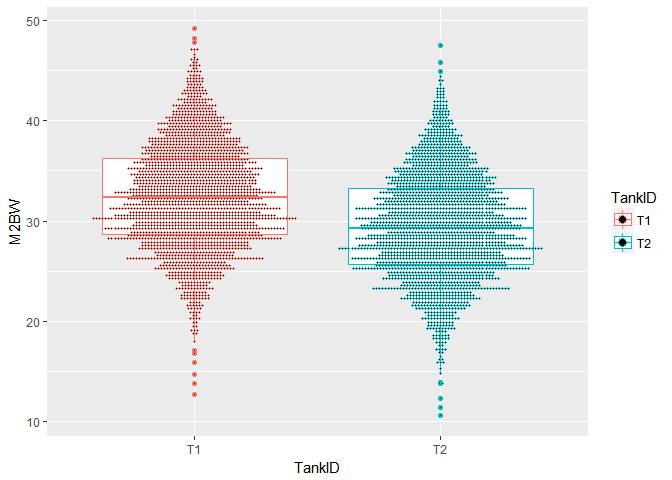

学习线性混合效应模型（Linear Mixed Effects Model，LMM）最好的方法，是一边学习理论，一边动手实践，这样印象最为深刻。
本文参考了Bodo Winter博士的教程Linear models and linear mixed effects models in R[教程1](http://www.bodowinter.com/tutorial/bw_LME_tutorial1.pdf)[教程2](http://www.bodowinter.com/tutorial/bw_LME_tutorial2.pdf)的结构。
本文中，为了便于理解，使用的数据集是来自csv文件[shrimp](https://luansheng.github.io/code/shrimp.csv)中的对虾育种数据。

推荐使用[Rstudio](https://www.rstudio.com/products/RStudio/)来运行[R](https://www.r-project.org/)。
本文代码使用了三个包，请提前加载。
* data.table
* ggplot2
* lme4 
* sjPlot

加载方法：可以在控制台（console）运行`require(data.table)`命令，加载data.table包。其他包加载命令类似。

初学者提示：
* R代码和shrimp.csv最好保存在同一个路径下，譬如c:\shrimp文件下
* 设置工作路径到c:\shrimp，`setwd("c:/shrimp")`

## 1 读取数据文件

fread函数来自data.table包，特点是对大文件读取速度特别快。建议使用data.table作为数据处理的主力包。

其中的参数sep表示文件是用逗号分割，header表示数据文件中第一行是列名，stringsAsFactors表示读入的数据，对于字符类型，是否自动处理为因子类型。为了方便后边模型处理，这里设置为因子类型。

str()函数可以对数据集有一个汇总。从中看可以看出，AnimalID-个体编号，SireID-父本编号，DamID-母本编号，FamilyID-家系编号，SexID-性别，TankID-测试池号等字符类型，已经被设置为因子类型了。M1BW-入池前体重，M2BW-收获体重和M2Age-收获时日龄均为数字变量。

```r
shrimp <- fread(input = "shrimp.csv",sep = ",",header = TRUE,stringsAsFactors = TRUE)
str(shrimp)
```

```
## Classes 'data.table' and 'data.frame':	4282 obs. of  10 variables:
##  $ AnimalID: Factor w/ 4282 levels "13G1000001","13G1000002",..: 1322 1310 1317 1684 2342 2358 3897 3979 3329 3504 ...
##  $ SireID  : Factor w/ 100 levels "12G000K010","12G000K065",..: 12 12 12 12 12 12 76 76 12 12 ...
##  $ DamID   : Factor w/ 91 levels "12G000K052","12G000K097",..: 70 70 70 70 70 70 10 10 70 70 ...
##  $ PopID   : Factor w/ 4 levels "Pop1","Pop2",..: 4 4 4 4 4 4 3 3 4 4 ...
##  $ FamilyID: Factor w/ 105 levels "13F1306003","13F1306004",..: 21 21 21 21 21 21 61 61 21 21 ...
##  $ SexID   : Factor w/ 2 levels "Female","Male": 2 1 1 1 1 1 1 1 2 2 ...
##  $ TankID  : Factor w/ 2 levels "T1","T2": 1 1 1 1 1 1 1 1 1 1 ...
##  $ M1BW    : num  3.5 3.5 3.5 3.5 3.5 3.5 3.58 3.58 3.76 3.76 ...
##  $ M2BW    : num  23 25.6 28.5 33.2 34.2 34.6 24.3 26.7 26.1 26.2 ...
##  $ M2Age   : int  212 212 212 212 212 212 222 222 213 213 ...
##  - attr(*, ".internal.selfref")=<externalptr>
```
数据文件准备完毕，我们正式开始学习线性混合效应模型。

## 2 引子：线性混合效应模型可以做什么

我们从一个简单的问题开始。对虾是有性别的，分雌雄。如果你对对虾没有任何了解，你可能会想知道，雄虾和雌虾的体重差别大吗？

我们测定了4282尾虾的体重。

我们首先直观的看一下雌雄虾体重分布点图。

```r
ggplot(data=shrimp,aes(x=SexID,y=M2BW,color=SexID))+geom_boxplot()+geom_dotplot(binaxis = "y",stackdir = "center",position = "dodge",binwidth = 0.25)
```

<div class="figure" style="text-align: left">

<p class="caption">图1 雌雄虾体重分布点图</p>
</div>
从图1中可以大体看出，雌虾体重比雄虾高。然后，我们实际计算雌雄虾体重均值，发现雌虾的确比雄虾重。

```r
shrimp.sex.m2bw <- shrimp[,mean(M2BW,na.rm=TRUE),by=.(SexID)]
shrimp.sex.m2bw
```

```
##     SexID       V1
## 1:   Male 27.77438
## 2: Female 33.93992
```

我们不禁要问，雌雄虾的这个差别是真实的吗？这是雌雄虾体重真正的差值吗？这个结果有没有偏差？

分析一下数据，你会发现，雌雄虾分布在2多个测试池中，且来自105个家系，并且每个家系的入池体重是存在差别的。而且你会发现，两个池子的养殖管理水平存在较大差别。


```r
ggplot(shrimp,aes(x=TankID,y=M2BW,color=TankID))+geom_boxplot()+geom_dotplot(binaxis = "y",stackdir = "center",position = "dodge",binwidth = 0.3)
```

<!-- -->

我们需要去除测试池、家系对雌雄虾体重的影响，准确估计雌雄虾体重。接下来就要用到线性模型了。

## 3 线性混合效应模型简介

<a id="1">模型1</a>

$$M2BW = Sex + \varepsilon$$

表示一尾虾的体重由性别和随机误差决定。其中$$Sex$$作为固定效应，$$\varepsilon$$作为随机效应。后者表示所有影响体重的不可测量的效应总和，是随机和不可控制的。

从数据中我们发现，一尾虾的体重还受它所在的测试池和所在家系的影响。因此，这两个效应也需要放到模型中。模型进一步变为：

<a id="2">模型2</a>

$$M2BW = Sex + Tank +\varepsilon$$

<a id="3">模型3</a>

$$M2BW = Sex + Tank + Family +\varepsilon$$

新加入的两个变量，Tank和Family，如果都作为固定效应。那么上述模型称为线性模型。如果Family作为随机效应，那么上述模型称为线性混合效应模型（固定效应+随机效应）。

这里碰到的一个棘手问题是，模型中一个效应到底是作为固定效应，还是随机效应？准确的说，应该是与研究目的相关。

SAS for Mixed models (Second edition) 手册中对固定效应的定义为：“An effect is called fixed if the levels in the study represent all possible levels of the factor, or at least all levels about which inference is to be made”。可简单地理解为“该效应的所有水平在实验群体中都已经出现”。譬如在本数据集中，性别只有雌、雄两个水平，因此模型中性别一般作为固定效应。再比如，测试投喂5种饲料对对虾体重的影响。由于目的很明确，只是评估这5种饲料的差异，因此饲料应作为固定效应。

随机效应的定义为：“Factor effects are random if they are used in the study to represent only a sample (ideally, a random sample) of a larger set of potential levels”。可简单地理解为“试验群体出现的该效应的水平只是一个很大水平数中的随机抽样。

固定效应和随机效应的差别在哪里？“一个效应作为固定效应，还是随机效应，应该依据研究的目的而定”。“a factor is considered random if its levels plausibly represent a larger population with a probability distribution”。如果我们分析一个效应的目的是为了研究它所在的一个具有概率分布的大群体的情况，那么这个效应应该作为随机效应。随机效应有两个特点，a) 它是大群体中的一个样本，b) 它具有概率分布。

譬如在shrimp数据集中，我们当前的目的是分析雌雄两个性别的体重差异，那么105个家系就是很大家系中的一个小样本，因此作为随机效应更为合适。

## 4 线型混合效应模型R实战分析

### 4.1 简单线性模型

`lm()`是R自带的函数。`summary()`函数输出shrimp.lm的结果。

```r
shrimp.lm <- lm(M2BW~SexID,shrimp)
shrimp.lm.sum <- summary(shrimp.lm)
shrimp.lm.sum
```

```
## 
## Call:
## lm(formula = M2BW ~ SexID, data = shrimp)
## 
## Residuals:
##      Min       1Q   Median       3Q      Max 
## -22.5399  -2.8744   0.1256   3.0601  15.2601 
## 
## Coefficients:
##             Estimate Std. Error t value Pr(>|t|)    
## (Intercept)  33.9399     0.0974   348.4   <2e-16 ***
## SexIDMale    -6.1655     0.1404   -43.9   <2e-16 ***
## ---
## Signif. codes:  0 '***' 0.001 '**' 0.01 '*' 0.05 '.' 0.1 ' ' 1
## 
## Residual standard error: 4.591 on 4280 degrees of freedom
## Multiple R-squared:  0.3105,	Adjusted R-squared:  0.3104 
## F-statistic:  1928 on 1 and 4280 DF,  p-value: < 2.2e-16
```

现在解释上边的结果。首先来看`Multiple R-squared:` 0.3105178，它表示模型对总体方差的解释能力。具体意思可以解释为，总体方差中的31.05%，可以由这个模型来解释。`Adjusted R-squared`是对`Multiple R-squared`的矫正，主要是考虑了固定效应。固定效应越多，该值越低。

下一个概念是非常的重要，那就是p值。P值是否小于0.05或者0.001，已经成为文章结果是否可靠，是否能够发表的一个重要标志。但是，p值一定程度上就像SCI论文的影响因子，有点滥用的味道。Nature上关于p值的故事:[中文版本](http://blog.sciencenet.cn/blog-265205-771680.html)；[英文版本](http://www.nature.com/news/scientific-method-statistical-errors-1.14700)。

我们还本溯源，本质上p值是一个条件概率，它表示**无效假设为真时的概率**。那什么是无效假设呢？在上文中，无效假设是**“对于体重性状，雌雄虾间没有差异”**，也就是说雌雄虾体重是相等的。在本文中，p值为<0.001 ，意味着如果”雌雄间没有差异，那么数据基本上不可能是这样“，因为**雌雄间没有差异**的概率太低！这反过来表明，性别影响了对虾的体重，雌雄虾体重是有差别的，也就是说统计上是显著的。

需要注意的另外一个问题是，模型所有效应的显著性（最底部）与系数列表单个效应的显著性还是存在差别的。上文中，两个结果是一致的，主要是因为模型中只包括1个固定效应。如果有更多效应，这两个值就不再相等。

F值是我们应该关注的另外一个参数，表示模型是否显著的一个重要参数。F值可以简单理解为处理方差与误差方差的比值，譬如在上文中，可以理解为性别间体重方差与残差方差的比值，这个值越大，那么表示雌雄间体重差异越大。需要注意，在上文中F值是1928，与两个自由度有关系（性别2-1；误差4281-1）。

接下来重点讨论系数列表。你会看到SexIDMale，你可能会问，SexID有两个水平，Female去哪里了？Estimates这一列表示的固定效应值到底是什么意思？

首先看一下系数列表中的(Intercept) 项，估计值是33.9399 ，是不是感觉很熟悉？它是Female体重的均值。在本文前边我们估计了雌雄体重的均值。

再看一下SexIDMale的估计值，是-6.1655。Intercept估计值+SexIDMale估计值=雄虾体重值27.77。为什么要用雌虾体重值作为截距？为什么雄虾体重固定效应估计值要表示为与截距，也就是雌虾体重值的差值？这里没有雌虾固定效应，可以认为是0。

第一个问题，之所以选择雌虾而不是雄虾作为截距，只是因为Female和Male这两个水平Female根据字母排序在Male前边。

第二个问题，之所以把雄虾体重固定效应值表示为与截距之差，是为了与协变量等统一起来。为了解释，大家先看图。

```r
sex.bw <- shrimp[,mean(M2BW,na.rm=TRUE),by=.(SexID)]

ggplot(data=shrimp,aes(x=SexID,y=M2BW,color=SexID))+
  geom_dotplot(binaxis = "y",stackdir = "center",position = "dodge",binwidth = 0.25)+
  geom_vline(xintercept = 1)+
  geom_vline(xintercept = 2)+
  geom_hline(yintercept = 33.93992)+
  geom_hline(yintercept = 27.77438)+
  geom_abline(intercept = 40.75,slope=-6.6155)+
  geom_text(x=2.4,y=31.5,label="-6.6155")+
  annotate("segment",x=2.5,xend=2.5,y=27.77438,yend = 33.93992)
```

<!-- -->

因为Female和Male均为因子变量，因此在x轴上可以将Female标准化为0，Male与Female的间距为1，二者体重差值为-6.6155，那么斜线的斜率可以认为等于-6.6155。这样就可以很方便的求解或者说预测体重。

我们可以根据[模型1](#1)，预测雌雄虾体重：

我们随机选取一尾虾，如果是雄虾，那么斜率为-6.1655，雄虾的预测体重为：

$$
BW = 群体均值 + 雄虾的固定效应 \\
   = 33.9399 + -6.1655*1 \\
   = 27.7744
$$ 

我们随机选取一尾虾，如果是雌虾，因为截距本身设置为雌虾体重均值，因此斜率为0，雌虾的预测体重为：

$$
BW = 群体均值 + 雌虾的固定效应 \\
   = 33.9399 + 0*1 \\
   = 33.9399
$$ 

我们继续来看一个稍微复杂的例子，在模型中加入TankID效应

```r
shrimp.lm.sex.tank <- lm(M2BW~SexID+TankID,shrimp)
shrimp.lm.sex.tank.sum <- summary(shrimp.lm.sex.tank)
shrimp.lm.sex.tank.sum
```

```
## 
## Call:
## lm(formula = M2BW ~ SexID + TankID, data = shrimp)
## 
## Residuals:
##      Min       1Q   Median       3Q      Max 
## -21.0480  -2.7480   0.0735   2.8520  15.0520 
## 
## Coefficients:
##             Estimate Std. Error t value Pr(>|t|)    
## (Intercept)  35.4265     0.1135  312.14   <2e-16 ***
## SexIDMale    -6.1600     0.1329  -46.37   <2e-16 ***
## TankIDT2     -2.9786     0.1328  -22.44   <2e-16 ***
## ---
## Signif. codes:  0 '***' 0.001 '**' 0.01 '*' 0.05 '.' 0.1 ' ' 1
## 
## Residual standard error: 4.344 on 4279 degrees of freedom
## Multiple R-squared:  0.3831,	Adjusted R-squared:  0.3828 
## F-statistic:  1329 on 2 and 4279 DF,  p-value: < 2.2e-16
```

从上边模型中可以看出，截距是35.4265。我们把数据汇总一下：


```r
shrimp[,mean(M2BW,na.rm=TRUE),by=.(SexID,TankID)]
```

```
##     SexID TankID       V1
## 1:   Male     T1 29.25391
## 2: Female     T1 35.43819
## 3:   Male     T2 26.30058
## 4: Female     T2 32.43625
```

我们发现，模型实际上是把Female.T1这个组合均值设置为截距（群体均值）。Male到Female.T1的斜率为-6.16，T2到Female.T1的斜率为-2.9786；同理，Female到Female.T1的斜率为0，T1到Female.T1的斜率也为0。

那么，根据[模型2](#2),可以预测雌雄虾体重：

如果随机从T1池捞取一尾雄虾，它的预测体重为：

$$
BW = 群体均值 + 雄虾的固定效应 + T1池固定效应 \\
   = 35.4265 + -6.16*1 + 0*1 \\
   = 29.26
$$
这个数值跟Male.T1的值29.25非常接近。

如果随机从T2池捞取一尾雄虾，它的预测体重为

$$
BW = 群体均值 + 雄虾的固定效应 + T2池固定效应 \\
   = 35.4265 + -6.1600*1 + -2.9786*1 \\
   = 26.2879
$$

这个数值跟Male.T2的均值26.30非常接近。

如果随机从T2池捞取一尾雌虾，它的预测体重为

$$
BW = 群体均值 + 雌虾的固定效应 + T2池固定效应 \\
   = 35.4265 + 0*1 + -2.9786*1 \\
   = 32.44
$$

这个数值跟Female.T2的均值32.436非常接近。

### 4.2 带协变量的线性模型
什么是协变量（covariate)？ wikipedia中是这样解释[协变量](https://en.wikipedia.org/wiki/Covariate)的：In statistics, a covariate is a variable that is possibly predictive of the outcome under study. A covariate may be of direct interest or it may be a confounding or interacting variable. The alternative terms explanatory variable, independent variable, or predictor, are used in a regression analysis.

举个简单例子，我们从每个家系选择选择30尾个体，尾部用VIE颜色标记后，混合养殖在一起，比较每个家系的生长性能。需要考虑的一个问题就是，混合养殖前每个家系的大小，是不一样的。一般，混养前体重越大的家系，混养结束时体重也会越大。我们在分析混养后体重时，需要考虑混养前每个家系体重对它的影响。这个混养前家系体重，就是一个协变量，在回归分析中，也会称为自变量，解释变量。

计算每个家系的混养后平均收获体重（M2BW）


```r
shrimp.taggingbw.per.family <-  shrimp[,lapply(.SD,mean,na.rm=TRUE),by=.(FamilyID),.SDcols=c("M1BW","M2BW")]
shrimp.taggingbw.per.family
```

```
##        FamilyID      M1BW     M2BW
##   1: 13F1306029  3.890238 27.21860
##   2: 13F1306714  4.010000 30.29500
##   3: 13F1306028  4.502000 30.96800
##   4: 13F1306046  4.445319 28.25385
##   5: 13F1306044  4.619737 26.90000
##  ---                              
## 101: 13F1306020  9.263158 29.15263
## 102: 13F1306058  9.645000 31.65909
## 103: 13F1367078  9.446190 37.24651
## 104: 13F1367091  9.466667 32.77949
## 105: 13F1306728 10.681190 35.67619
```

绘制出混养前家系初始体重（M1BW）和混养后体重的散点图（M2BW）


```r
ggplot(data=shrimp.taggingbw.per.family,aes(x=M1BW,y=M2BW))+
  geom_point()+
  geom_smooth(method = "lm")
```

<!-- -->

很明显，二者表现为正相关，相关系数为0.44。因此在对比雌雄体重差异时，需要考虑加入M1BW作为协变量，对M2BW进行校正。

分析下边2个模型：

<a id="4">模型4</a>

$$M2BW = M1BW + \varepsilon$$


```r
shrimp.lm.m1bw <- lm(M2BW ~ M1BW,shrimp)
summary(shrimp.lm.m1bw)
```

```
## 
## Call:
## lm(formula = M2BW ~ M1BW, data = shrimp)
## 
## Residuals:
##      Min       1Q   Median       3Q      Max 
## -20.1879  -3.8502  -0.1894   3.7519  17.6528 
## 
## Coefficients:
##             Estimate Std. Error t value Pr(>|t|)    
## (Intercept) 24.95552    0.44265   56.38   <2e-16 ***
## M1BW         0.82596    0.05975   13.82   <2e-16 ***
## ---
## Signif. codes:  0 '***' 0.001 '**' 0.01 '*' 0.05 '.' 0.1 ' ' 1
## 
## Residual standard error: 5.416 on 4239 degrees of freedom
##   (41 observations deleted due to missingness)
## Multiple R-squared:  0.04313,	Adjusted R-squared:  0.04291 
## F-statistic: 191.1 on 1 and 4239 DF,  p-value: < 2.2e-16
```

上边实际上是简单的回归分析，系数表中Intercept为24.96，表示当M1BW为0时，混养体重M2BW为24.96g。实际上初始体重不可能为0。因此这个截距没有实际意义。

M1BW的系数估计值为0.83，表示初始体重每增加1g，混养体重会增加0.83g。

<a id="5">模型5</a>

$$M2BW = Sex + Sex:M1BW + \varepsilon$$


```r
shrimp.lm.sex.m1bw <- lm(M2BW~SexID+SexID:M1BW,shrimp)
summary(shrimp.lm.sex.m1bw)
```

```
## 
## Call:
## lm(formula = M2BW ~ SexID + SexID:M1BW, data = shrimp)
## 
## Residuals:
##      Min       1Q   Median       3Q      Max 
## -23.1754  -2.7973   0.1325   2.9258  14.6841 
## 
## Coefficients:
##                  Estimate Std. Error t value Pr(>|t|)    
## (Intercept)      27.82303    0.49401  56.321   <2e-16 ***
## SexIDMale        -6.05195    0.73069  -8.283   <2e-16 ***
## SexIDFemale:M1BW  0.84089    0.06667  12.613   <2e-16 ***
## SexIDMale:M1BW    0.82480    0.07270  11.346   <2e-16 ***
## ---
## Signif. codes:  0 '***' 0.001 '**' 0.01 '*' 0.05 '.' 0.1 ' ' 1
## 
## Residual standard error: 4.453 on 4237 degrees of freedom
##   (41 observations deleted due to missingness)
## Multiple R-squared:  0.3533,	Adjusted R-squared:  0.3528 
## F-statistic: 771.6 on 3 and 4237 DF,  p-value: < 2.2e-16
```

这个模型稍微复杂一些。从系数列表中，针对雌性两个性别，给出了不同的回归系数。这主要是由于雌雄生长速度的差异造成的，后期雌虾生长速要快于雄虾。


```r
ggplot(data=shrimp,aes(x=M1BW,y=M2BW,color=SexID))+geom_point()
```

```
## Warning: Removed 41 rows containing missing values (geom_point).
```

<!-- -->

我们根据[模型5](#5)来预测一尾雄虾的体重,假定它的混养前体重为5g，那么它的混养后体重为25.87g。

$$
M2BW = 27.82 + -6.05 + 0.82*5 \\
=25.87g
$$

### 4.3 包括交互效应的线性模型

模型已经变的越来越复杂了。我们进一步在[模型5](#5)中加入养殖池TankID效应。

<a id="6">模型6</a>

$$M2BW = Sex + Tank + Sex:M1BW$$


```r
shrimp.lm.sex.tank.m1bw <- lm(M2BW ~ SexID + TankID + SexID:M1BW,shrimp)
summary(shrimp.lm.sex.tank.m1bw)
```

```
## 
## Call:
## lm(formula = M2BW ~ SexID + TankID + SexID:M1BW, data = shrimp)
## 
## Residuals:
##      Min       1Q   Median       3Q      Max 
## -21.7146  -2.6244   0.1257   2.7420  15.6559 
## 
## Coefficients:
##                  Estimate Std. Error t value Pr(>|t|)    
## (Intercept)      29.13570    0.46947  62.061  < 2e-16 ***
## SexIDMale        -5.56384    0.68954  -8.069 9.16e-16 ***
## TankIDT2         -2.96107    0.12907 -22.942  < 2e-16 ***
## SexIDFemale:M1BW  0.86425    0.06289  13.742  < 2e-16 ***
## SexIDMale:M1BW    0.78082    0.06860  11.383  < 2e-16 ***
## ---
## Signif. codes:  0 '***' 0.001 '**' 0.01 '*' 0.05 '.' 0.1 ' ' 1
## 
## Residual standard error: 4.2 on 4236 degrees of freedom
##   (41 observations deleted due to missingness)
## Multiple R-squared:  0.4248,	Adjusted R-squared:  0.4242 
## F-statistic:   782 on 4 and 4236 DF,  p-value: < 2.2e-16
```

从Adjusted R-squared参数（0.42 vs 0.31可以看出，模型6 对数据的解释能力，相比模型1，已经大幅度提高了。也就是说根据模型6预测体重，准确性比模型1要高。

什么是交互效应？Interaction effects represent the combined effects of factors on the dependent measure. When an
interaction effect is present, the impact of one factor depends on the level of the other factor。两个效应间相互影响，促进或者制约的关系。

譬如，我们数据中有Sex和Tank两个固定效应，那么我们可能会想 雌虾会不会在特别偏爱某种环境，譬如在T1池中长得比T2池中大，但是雄虾可能会在T2池中长的比T1池大？因此我们可以在模型中试着加入交互效应。

<a id="7">模型7</a>

$$M2BW = Sex + Tank + Sex:Tank + Sex:M1BW$$


```r
shrimp.lm.sex.tank.m1bw.interaction <- lm(M2BW ~ SexID + TankID + SexID:TankID + SexID:M1BW,shrimp)
summary(shrimp.lm.sex.tank.m1bw.interaction)
```

```
## 
## Call:
## lm(formula = M2BW ~ SexID + TankID + SexID:TankID + SexID:M1BW, 
##     data = shrimp)
## 
## Residuals:
##      Min       1Q   Median       3Q      Max 
## -21.6692  -2.6120   0.1154   2.7398  15.7023 
## 
## Coefficients:
##                    Estimate Std. Error t value Pr(>|t|)    
## (Intercept)        29.17643    0.47273  61.719  < 2e-16 ***
## SexIDMale          -5.66459    0.70297  -8.058 9.99e-16 ***
## TankIDT2           -3.05296    0.17937 -17.021  < 2e-16 ***
## SexIDMale:TankIDT2  0.19059    0.25831   0.738    0.461    
## SexIDFemale:M1BW    0.86498    0.06290  13.751  < 2e-16 ***
## SexIDMale:M1BW      0.78228    0.06863  11.399  < 2e-16 ***
## ---
## Signif. codes:  0 '***' 0.001 '**' 0.01 '*' 0.05 '.' 0.1 ' ' 1
## 
## Residual standard error: 4.201 on 4235 degrees of freedom
##   (41 observations deleted due to missingness)
## Multiple R-squared:  0.4248,	Adjusted R-squared:  0.4242 
## F-statistic: 625.7 on 5 and 4235 DF,  p-value: < 2.2e-16
```

从系数表中，可以看出，相比两个主效应（SexIDMale：-5.66、TankIDT2：-3.05），Sex和Tank的交互效应非常小（0.19），p=0.461 > 0.05，统计检验与0相比，达不到显著水平。Adjusted R-squared:  0.4242也表明，相比[模型6](#6)，[模型7](#7)的解释能力并没有提高。

我们图形展示一下模型7固定效应


```r
plot_model(shrimp.lm.sex.tank.m1bw.interaction,show.values = TRUE)
```

<!-- -->

不考虑除残差外的随机效应，目前模型6是最优模型。我们根据[模型6](#6)，可以回答最初的问题，雌雄体重间差异显著。接下来，我们会考虑在模型中刚加入随机效应，进入线性混合效应模型部分。


