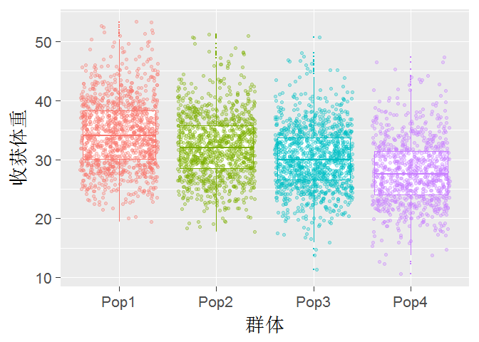
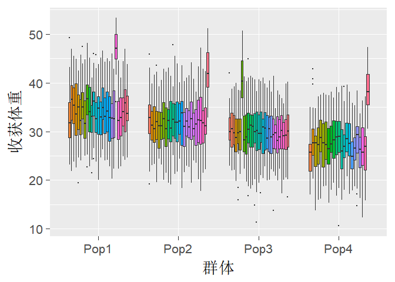
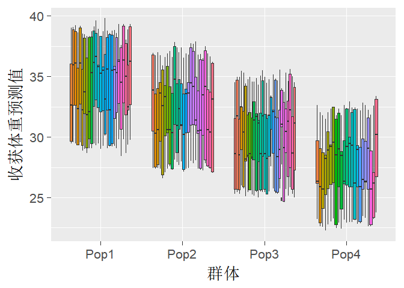

[上接线性混合效应模型教程1](https://luansheng.github.io/2017/11/19/%E7%BA%BF%E6%80%A7%E6%B7%B7%E5%90%88%E6%95%88%E5%BA%94%E6%A8%A1%E5%9E%8B%E6%95%99%E7%A8%8B1/)

本部分可能会用到的R包，请提前安装：
* ggplot2 #优秀的作图包
* data.table #优秀的数据转换处理包
* lme4 #提供lmer函数，进行lmm分析
* lmerTest #提供anova函数，对固定效应进行显著性检验
* sjPlot #lmm结果的可视化展示

### 4.4 包括随机效应的线性混合效应模型

请加载一个新的数据集shrimpex.csv，其中有一个PopID字段，包括Pop1到Pop4共计4个水平，表示shrimp数据由四个群体组成。现在考虑这样一个问题：四个群体间收获体重是否存在差异。

首先加载数据文件。画出四个群体收获体重的箱形图，加上jitter点。

```r
shrimp <- fread(input = "shrimpex.csv",sep = ",",header = TRUE,stringsAsFactors = TRUE)
str(shrimp)
```

```
## Classes 'data.table' and 'data.frame':	4282 obs. of  10 variables:
##  $ AnimalID: Factor w/ 4282 levels "13G1000001","13G1000002",..: 3308 3307 2215 1303 3601 2184 2194 2175 1585 2176 ...
##  $ SireID  : Factor w/ 100 levels "12G000K010","12G000K065",..: 81 81 81 81 81 81 81 81 81 81 ...
##  $ DamID   : Factor w/ 91 levels "12G000K052","12G000K097",..: 81 81 81 81 81 81 81 81 81 81 ...
##  $ PopID   : Factor w/ 4 levels "Pop1","Pop2",..: 1 1 1 1 1 1 1 1 1 1 ...
##  $ FamilyID: Factor w/ 105 levels "13F1306003","13F1306004",..: 6 6 6 6 6 6 6 6 6 6 ...
##  $ SexID   : Factor w/ 2 levels "Female","Male": 2 2 1 1 1 2 1 2 2 1 ...
##  $ TankID  : Factor w/ 2 levels "T1","T2": 1 1 1 1 1 1 1 1 1 1 ...
##  $ M1BW    : num  8.13 8.13 8.13 8.13 8.13 8.55 8.55 8.55 8.55 8.55 ...
##  $ M2BW    : num  29 30.5 33.3 40.1 43 29.1 30.7 30.7 32.5 35.6 ...
##  $ M2Age   : int  219 219 219 219 219 219 219 219 219 219 ...
##  - attr(*, ".internal.selfref")=<externalptr>
```

```r
ggplot(data=shrimp,aes(x=PopID,y=M2BW,color=PopID)) + 
  geom_boxplot(outlier.size = 0)+
  geom_jitter(alpha=0.3)+
  labs(x="群体",y="收获体重")+
  theme_gray(base_size = 20)+
  theme(legend.position = "none")
```

<!-- -->

从上图中，大致可以看出，群体间是存在差异的。

进一步分析数据，你会发现每个群体由多个家系组成，见下图。


```r
ggplot(data=shrimp,aes(x=PopID,y=M2BW,fill=FamilyID)) + 
  geom_boxplot(outlier.size = 0)+
  labs(x="群体",y="收获体重")+
  theme_gray(base_size = 20)+
  theme(legend.position = "none")
```

<!-- -->

这里遇到了一个问题，在评价群体间的差异时，是否需要考虑每个群体内的家系结构？

理论上，我们从每个群体抽样时，抽样个体是代表该群体的随机样本。但是，一个群体内的个体往往存在亲缘关系，譬如（全同胞、半同胞个体）。因此抽样个体存在两个层次：每个群体包括多个家系，每个家系包括数量不等的个体。

从上图中可以看出，每个群体内的不同家系间是存在差异的。为了说明家系结构对分析结果的影响，故意在每个群体中设置了一个均值特别高的家系。在实际测试数据中，这种现象也会经常出现。如果我们分析时不考虑群体内的家系结构，那么家系方差会被累加到残差方差中。

根据教程1对于固定效应和随机效应的讨论，由于我们的目的是要分析四个群体间的差异，获得每个群体的性能，因此群体更适合做固定效应。每个群体是由多个家系组成的，这些家系只是大量家系的一个随机抽样，因此更加适合作为随机效应。

下边我们通过两个模型实例，来看一下家系结构对分析结果的影响。

<a id="8">模型8</a>

$$M2BW = Pop + Sex + Tank + Sex:M1BW$$

[模型8](#8)不考虑家系结构，Pop、Sex和Tank为固定效应，Sex:M1BW为协变量。

分析结果如下：


```r
shrimp.lm.8 <- lm(M2BW ~ 1 + PopID + SexID + TankID + SexID:M1BW,shrimp)
summary(shrimp.lm.8) #加载lmerTest包后，lmer的返回结果，每个固定效应系数带有P值
```

```
## 
## Call:
## lm(formula = M2BW ~ 1 + PopID + SexID + TankID + SexID:M1BW, 
##     data = shrimp)
## 
## Residuals:
##      Min       1Q   Median       3Q      Max 
## -20.7242  -2.5787  -0.2092   2.2353  18.9070 
## 
## Coefficients:
##                  Estimate Std. Error t value Pr(>|t|)    
## (Intercept)      35.42932    0.53924  65.702  < 2e-16 ***
## PopIDPop2        -1.61211    0.18406  -8.759  < 2e-16 ***
## PopIDPop3        -3.61817    0.18086 -20.005  < 2e-16 ***
## PopIDPop4        -5.76930    0.21237 -27.166  < 2e-16 ***
## SexIDMale        -5.39346    0.70557  -7.644 2.59e-14 ***
## TankIDT2         -2.93073    0.13206 -22.192  < 2e-16 ***
## SexIDFemale:M1BW  0.40396    0.06778   5.960 2.73e-09 ***
## SexIDMale:M1BW    0.30223    0.07363   4.105 4.13e-05 ***
## ---
## Signif. codes:  0 '***' 0.001 '**' 0.01 '*' 0.05 '.' 0.1 ' ' 1
## 
## Residual standard error: 4.296 on 4233 degrees of freedom
##   (41 observations deleted due to missingness)
## Multiple R-squared:  0.4845,	Adjusted R-squared:  0.4837 
## F-statistic: 568.4 on 7 and 4233 DF,  p-value: < 2.2e-16
```

```r
anova(shrimp.lm.8) #lmerTest包提供该函数
```

```
## Analysis of Variance Table
## 
## Response: M2BW
##              Df Sum Sq Mean Sq  F value    Pr(>F)    
## PopID         3  23856    7952  430.856 < 2.2e-16 ***
## SexID         1  39588   39588 2144.973 < 2.2e-16 ***
## TankID        1   9106    9106  493.407 < 2.2e-16 ***
## SexID:M1BW    2    889     445   24.095 3.934e-11 ***
## Residuals  4233  78124      18                       
## ---
## Signif. codes:  0 '***' 0.001 '**' 0.01 '*' 0.05 '.' 0.1 ' ' 1
```

<a id="9">模型9</a>考虑家系结构，Pop:Family为随机效应，Pop、Sex和Tank为固定效应，Sex:M1BW为协变量。

$$M2BW = Pop + Sex + Tank + Sex:M1BW + Pop:Family$$

在模型中加入随机效应，需要使用lme4包中的lmer函数。

分析结果如下：


```r
shrimp.lm.9 <- lmer(M2BW ~ 1 + PopID + SexID + TankID + SexID:M1BW  + (1|PopID:FamilyID),shrimp)
summary(shrimp.lm.9)
```

```
## Linear mixed model fit by REML t-tests use Satterthwaite approximations
##   to degrees of freedom [lmerMod]
## Formula: 
## M2BW ~ 1 + PopID + SexID + TankID + SexID:M1BW + (1 | PopID:FamilyID)
##    Data: shrimp
## 
## REML criterion at convergence: 23070.4
## 
## Scaled residuals: 
##     Min      1Q  Median      3Q     Max 
## -5.5304 -0.5854  0.0240  0.6388  3.8977 
## 
## Random effects:
##  Groups         Name        Variance Std.Dev.
##  PopID:FamilyID (Intercept)  5.933   2.436   
##  Residual                   12.527   3.539   
## Number of obs: 4241, groups:  PopID:FamilyID, 105
## 
## Fixed effects:
##                   Estimate Std. Error        df t value Pr(>|t|)    
## (Intercept)        35.7188     1.0605  487.0000  33.683  < 2e-16 ***
## PopIDPop2          -1.6596     0.6884  101.0000  -2.411  0.01774 *  
## PopIDPop3          -3.7742     0.6733  102.0000  -5.606 1.78e-07 ***
## PopIDPop4          -5.8638     0.7359  111.0000  -7.968 1.58e-12 ***
## SexIDMale          -5.6599     0.5901 4148.0000  -9.591  < 2e-16 ***
## TankIDT2           -2.9491     0.1097 4140.0000 -26.884  < 2e-16 ***
## SexIDFemale:M1BW    0.3757     0.1204  993.0000   3.122  0.00185 ** 
## SexIDMale:M1BW      0.2904     0.1231 1068.0000   2.360  0.01847 *  
## ---
## Signif. codes:  0 '***' 0.001 '**' 0.01 '*' 0.05 '.' 0.1 ' ' 1
## 
## Correlation of Fixed Effects:
##             (Intr) PpIDP2 PpIDP3 PpIDP4 SxIDMl TnIDT2 SIDF:M
## PopIDPop2   -0.384                                          
## PopIDPop3   -0.419  0.506                                   
## PopIDPop4   -0.519  0.476  0.494                            
## SexIDMale   -0.248  0.002  0.007 -0.004                     
## TankIDT2    -0.042 -0.006 -0.004 -0.001 -0.030              
## SxIDFm:M1BW -0.889  0.077  0.108  0.250  0.291 -0.010       
## SxIDMl:M1BW -0.711  0.074  0.100  0.246 -0.352  0.010  0.786
```

```r
anova(shrimp.lm.9)
```

```
## Analysis of Variance Table of type III  with  Satterthwaite 
## approximation for degrees of freedom
##            Sum Sq Mean Sq NumDF  DenDF F.value    Pr(>F)    
## PopID       914.2   304.7     3  103.8   24.33  5.33e-12 ***
## SexID      1152.4  1152.4     1 4148.3   92.00 < 2.2e-16 ***
## TankID     9053.7  9053.7     1 4140.1  722.75 < 2.2e-16 ***
## SexID:M1BW  122.4    61.2     2 1414.2    4.88  0.007695 ** 
## ---
## Signif. codes:  0 '***' 0.001 '**' 0.01 '*' 0.05 '.' 0.1 ' ' 1
```

把[模型8](#8)的Residual standard error的平方，与[模型9](#9) Random Effects部分对比，你会发现，如果不考虑家系结构，残差方差明显被高估,估计值为18.4559804 。考虑家系结构后，残差方差为12.5267428, 明显变小， 从残差中分离出了大部分的家系方差。

从anova方差分析的角度看，加入家系随机效应后，群体固定效应（PopID）尽管仍然也达到了显著水平，但是均方和F值明显变小。这表明存在这样一种风险，**如果考虑群体内的家系结构，本来两个群体的差异可能达不到显著水平，但是如果忽视了这种家系结构，两个群体间的差异统计上会表现为显著水平**，从而误判群体间的实际性能差别。

我们看一下，基于模型9（不包括家系的随机效应），预测四个群体家系的性能，如下图所示：你会发现，每个群体中特别大的家系效应，已经被剔除掉了。

ps：拟合值反应的是包括所有固定和随机效应的结果，lmer中通过fitted()函数获得该值。预测值，是可以设定不包括随机效应的，lmer中通过predict()函数获得该值。


```r
shrimp.lm.9.predict <- predict(shrimp.lm.9,re.form=NA) #拟合值
shrimp.lm.9.predict.dt <- data.table(ObsSeq =as.integer(names(shrimp.lm.9.predict)),PredictedValue=shrimp.lm.9.predict)
shrimp[,":="(ObsSeq=seq(nrow(shrimp)))]
#把拟合值合并到shrimp数据集
shrimp.predicted.value <- merge(shrimp,shrimp.lm.9.predict.dt,by = c("ObsSeq"),all.y = TRUE)


ggplot(data=shrimp.predicted.value,aes(x=PopID,y=PredictedValue,fill=FamilyID)) + 
  geom_boxplot(outlier.size = 0)+
  labs(x="群体",y="收获体重预测值")+
  theme_gray(base_size = 20)+
  theme(legend.position = "none")
```

<!-- -->

### 4.5 获得每个群体的性能


调用emmeans包中的函数，计算四个群体的估计边际均值(estimated marginal means)，或者说最小二乘均值(least-squares means)。根据边际均值，我们可以对群体的性能进行排序和比较。

关于emmeans包，请参考日志[最小二乘均值的估计模型](https://luansheng.github.io/2017/06/10/%E6%9C%80%E5%B0%8F%E4%BA%8C%E4%B9%98%E5%9D%87%E5%80%BC%E7%9A%84%E4%BC%B0%E8%AE%A1%E6%A8%A1%E5%9E%8B/)。尽管该日志介绍的是lsmeans包，但用法跟emmeans包都是一样的。而且根据作者介绍，在不久的将来，emmeans包要替代lsmeans包。

注意，安装emmeans还需要pbkrtest包，这个包没有自动安装，需要手动安装。


```r
require(emmeans)
```

```
## Loading required package: emmeans
```

```
## 
## Attaching package: 'emmeans'
```

```
## The following object is masked from 'package:lmerTest':
## 
##     lsmeans
```

```r
shrimp.lm9.rgl <- ref_grid(shrimp.lm.9)
```

```
## Loading required namespace: pbkrtest
```

```
## Note: D.f. calculations have been disabled because the number of observations exceeds 3000.
## To enable adjustments, set emm_options(pbkrtest.limit = 4241) or larger,
## but be warned that this may result in large computation time and memory use.
```

```r
emmeans(shrimp.lm9.rgl,"PopID")
```

```
##  PopID   emmean        SE df asymp.LCL asymp.UCL
##  Pop1  33.83782 0.4853477 NA  32.88656  34.78909
##  Pop2  32.17826 0.4903717 NA  31.21715  33.13937
##  Pop3  30.06359 0.4659862 NA  29.15028  30.97691
##  Pop4  27.97398 0.5373764 NA  26.92074  29.02722
## 
## Results are averaged over the levels of: SexID, TankID 
## Degrees-of-freedom method: asymptotic 
## Confidence level used: 0.95
```

从上边结果中查找emmean列，可以看到Pop1群体的边际均值最大，这表明四个群体中该群体性能最好。
